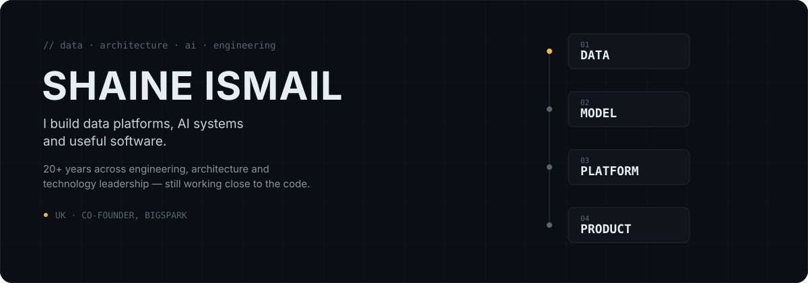

  

## 01 / Building

**[Little Solar](https://littlesolar.uk)**
Tools exploring solar, batteries, electrification and energy economics.

**Plug-in Solar**
Exploring the feasibility, safety and economics of plug-in solar systems in the UK.

**[Groundsman](https://groundsman.uk)**
Grounds management without the paperwork. Plan maintenance, record work, track machinery and keep a clear evidence trail — built for community sports clubs and grounds teams.

**Developer Tooling**
Ubuntu, CLI workflows, automation, containers and development environments.

## 02 / What I work on

- Enterprise data architecture
- Applied AI / LLM systems
- Data engineering and distributed systems
- Cloud data platforms
- Developer tooling and automation
- Energy / solar technology

## 03 / Background

Co-founder of Bigspark. 20+ years across data, engineering and architecture. Experience includes HSBC, NatWest/RBS, Deutsche Bank, JP Morgan, Swiss Re and Royal Bank of Canada.

## 04 / Toolkit

`Python` `Java` `AWS` `Azure` `Databricks` `Snowflake` `Spark` `Kafka` `Hadoop` `AI / LLMs`

## 05 / Elsewhere

[CV](./cv/shaine-ismail-cv.pdf) · [LinkedIn](https://www.linkedin.com/in/shaineismail/)
